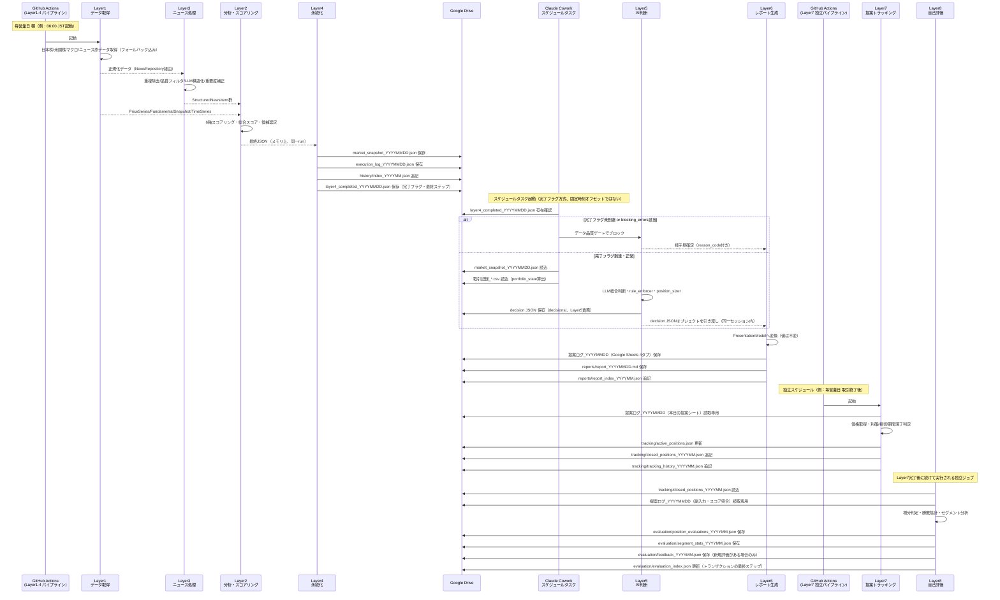
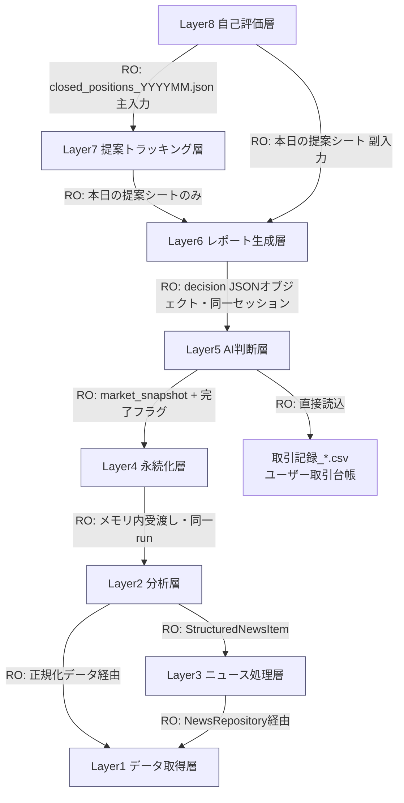
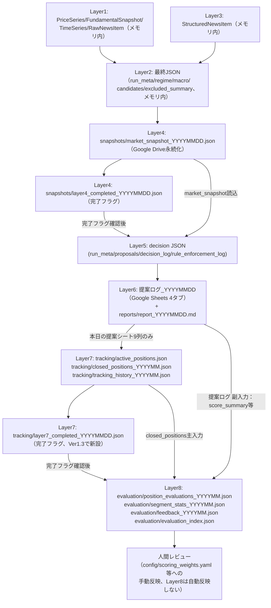
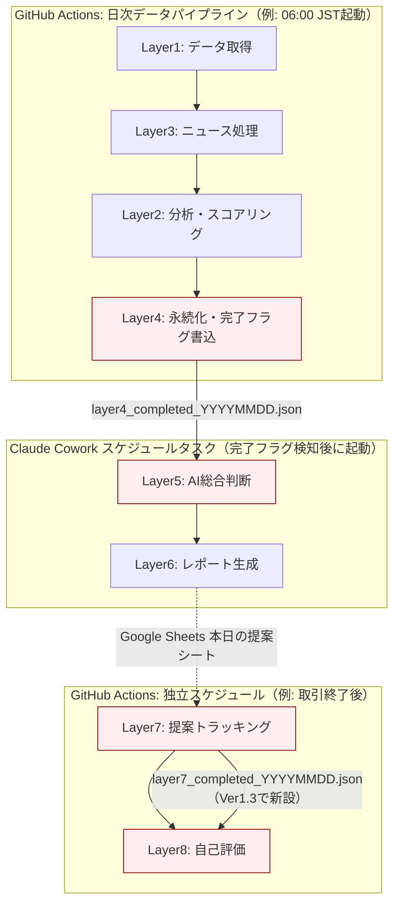

# AI投資アシスタント 全体設計書（System Architecture Overview）

作成日: 2026-07-18（Rev.3：実装者レビュー指摘への回答を反映し、Layer5・Layer7・Layer8の版上げに合わせて更新。Rev.2：改善提案（§14）へのご回答を反映。Rev.1：初版）
位置づけ: 本書はLayer1〜Layer8詳細設計書を要約・整理する「全体設計書」である。個別レイヤー設計書の仕様・責務・入出力・JSONスキーマ・フォルダ構成は、ご回答に基づき採用が決定した項目（§14・§15参照）を除き変更しない。本書中で新たに発見した不整合・改善点は本文を書き換えず、末尾「14. 改善提案」「15. 実装者レビュー指摘への対応」に分離して記載する。

前提とする確定済み設計書：

| レイヤー | 設計書 | 版 |
|---|---|---|
| Layer1（データ取得層） | layer1_data_acquisition_design.md | 確定版 |
| Layer2（分析層） | layer2_analysis_design.md | Ver1.4確定 |
| （companion）スコアリング仕様書 | scoring_specification.md | Ver1.2確定 |
| Layer3（ニュース処理層） | layer3_news_processing_design.md | Ver1.3確定 |
| Layer4（永続化層） | layer4_persistence_design.md | Ver1.1確定 |
| Layer5（AI判断層） | layer5_ai_judgment_design.md | **Ver1.5確定**（Rev.3でdecision JSON命名規則を追加） |
| Layer6（レポート生成層） | layer6_report_generation_design.md | Ver1.1確定 |
| Layer7（提案トラッキング層） | layer7_proposal_tracking_design.md | **Ver1.4確定**（Rev.3で完了フラグを追加） |
| Layer8（自己評価層） | layer8_self_evaluation_design.md | **Ver1.4確定**（Rev.3で完了フラグ確認ステップを追加） |

（Layer9「運用成績ダッシュボード」はLayer8設計書にて今回のスコープ外と確定済みのため、本書もLayer9を前提とした記述は行わない。将来Layer9を設計する際の拡張余地については§9・§14で触れる。）

---

## 1. システム概要

### 1-1. 目的

日々の市場データ・ニュース・マクロ指標を多角的に分析し、AIが投資候補を評価・提案し、その提案の実績を自動追跡・自己評価することで、人間のレビューを介した継続的改善を可能にする「AI投資アシスタント」を構築する。単なるニュース要約ツールではなく、**市場データそのものの定量分析を軸とし、LLMは定性判断・自然文説明・最終採否判断にのみ関与する**、市場データ分析AIシステムとして設計されている。

### 1-2. 設計思想（全レイヤー共通の原則）

- **数値計算とLLM判断の分離**：スコア計算・ランキング・推奨株数・損切/利確価格・統計集計は必ずPythonの決定的処理が担い、LLMがこれらを暗算・再計算することはない（Layer2・Layer4・Layer7・Layer8が決定的処理、Layer3・Layer5がLLM関与層）。
- **責務の単一化とRepository/Sink抽象化**：データソース（Layer1の`Repository`群）、LLMベンダー（Layer3の`NewsStructurer`、Layer5の将来`AIJudge`）、レポート出力先（Layer6の`ReportSink`）、価格取得（Layer7の`PriceCheckRepository`）は、いずれも抽象インターフェース＋設定ファイル切り替えで実装を差し替え可能にしている。
- **完全なログ・除外理由の保存**：採用・不採用を問わず全候補の判断ログ（`decision_log`）、除外理由（`reason_code`）、ルール適用結果（`rule_enforcement_log`）を保存し、後から検証可能にする。
- **上流層の不可侵**：各レイヤーは自分より上流（前段）のレイヤーが確定したJSONスキーマ・ファイルを変更しない。下流レイヤーは上流の成果物を「読み取り専用」で参照する（Layer6以降は特にこの原則の回帰テストを明示的に持つ）。
- **重みの自動調整は行わない**：Layer8の自己評価結果はあくまで人間レビュー用の提案（`feedback_YYYYMM.json`、`review_status: "pending_human_review"`）であり、スコア配点・重みへの自動反映は一切行わない。
- **Google Driveへの永続化一本化**：GitHubリポジトリにはソースコード・設定ファイル（`config/`等）のみを置き、実行結果・スナップショット・ログ・キャッシュ・トラッキングデータ・評価データはすべてGoogle Driveに保存する（リポジトリ肥大化の回避）。

### 1-3. レイヤー別責務一覧

| レイヤー | 名称 | 主な責務 | 実行モデル |
|---|---|---|---|
| Layer1 | データ取得層 | 日本株・米国株・マクロ・ニュースの生データ取得、フォールバック、正規化 | GitHub Actions（Pythonパイプライン） |
| Layer2 | 分析層 | テクニカル/ファンダメンタル/需給/マクロ/レジーム/ニュースの6軸スコアリング、総合スコア算出、候補選定・JSON生成 | 同上（Layer1と同一run） |
| Layer3 | ニュース処理層 | ニュース取得・重複除去・品質フィルタ・LLM構造化・重要度補正 | 同上（Layer2の内部利用として同一run） |
| Layer4 | 永続化層 | Layer2出力の非加工保存、完了フラグ生成、実行ログ・履歴インデックス管理 | 同上（Layer1〜3と同一run最終ステップ） |
| Layer5 | AI判断層 | 完了フラグ確認、LLMによる総合投資判断、推奨株数/損切/利確の確定計算、ハードルール強制 | Claude Coworkスケジュールタスク（AI Agent実行層） |
| Layer6 | レポート生成層 | decision JSONの表示用整形、Google Sheets/Markdown出力 | Layer5と同一Coworkセッション継続 |
| Layer7 | 提案トラッキング層 | 提案の実勢価格追跡、利確/損切/期間満了判定、実績記録 | GitHub Actions（独立スケジュール、決定的処理） |
| Layer8 | 自己評価層 | 提案実績の分析、成績集計、人間レビュー用フィードバック生成 | 独立スケジュールジョブ（Layer7完了後、決定的処理） |

---

## 2. 全体シーケンス図

Layer1〜8を通した1日の処理フロー（データ取得→分析→永続化→AI判断→レポート→トラッキング→自己評価）を示す。Layer7・Layer8は日次のGitHub Actionsパイプライン（Layer1〜4）およびClaude Coworkセッション（Layer5〜6）とは非同期に、独立したスケジュールで実行される。



---

## 3. レイヤー依存図

どのレイヤーがどのレイヤーの成果物を参照するか、および参照が読み取り専用（RO）か書き込み（RW/生成）かを示す。矢印は「参照する側→参照される側」。



**明示的に「参照しない」と各設計書で確定している関係（重要）**：

- Layer7・Layer8はいずれもLayer5のdecision JSON、Layer6のMarkdownレポート、Layer1〜4の出力に**直接アクセスしない**（必ずLayer6のGoogle Sheets経由）。
- Layer7・Layer8はLayer6の成果物（Google Sheets）を読み取り専用で参照し、書き込みは行わない。
- Layer4はLayer5・Layer6・Layer7・Layer8の成果物に一切関与しない（`decisions/`・`tracking/`・`evaluation/`はLayer4の管轄外、§4参照）。
- 上流から下流への一方向の依存のみで構成され、循環参照は存在しない（§14-1で検証）。

---

## 4. ディレクトリ構成

Google Drive「AI投資アシスタント」フォルダ全体（各レイヤー設計書のフォルダ仕様を集約）。

```
AI投資アシスタント/                        【Google Drive、永続化の唯一の保存先】
├── config/                              # 【共通】Layer1〜8共通の設定ファイル群（§6参照）
├── snapshots/                            【Layer4管理】
│   ├── market_snapshot_YYYYMMDD.json
│   ├── market_snapshot_YYYYMMDD_supersededTHHMMSSZ.json   # 同日再実行時の旧版
│   └── layer4_completed_YYYYMMDD.json    # 完了フラグ（Layer5との契約の核）
├── logs/                                【Layer4管理】
│   └── execution_log_YYYYMMDD.json
├── history/                             【Layer4管理・新設】
│   └── index_YYYYMM.json                 # 日次実行サマリの月次インデックス
├── contracts/                           【Layer4管理・新設】
│   ├── market_snapshot.schema.json
│   ├── layer4_completed.schema.json
│   └── execution_log.schema.json
├── decisions/                           【Layer5管理】
│   └── decision_YYYYMMDDTHHMMSSZ.json    # Ver1.4で命名規則を確定（UTC秒単位タイムスタンプ、§14参照）
├── reports/                             【Layer6管理・新設】
│   ├── report_YYYYMMDD.md
│   └── report_index_YYYYMM.json
├── tracking/                            【Layer7管理・新設】
│   ├── active_positions.json
│   ├── closed_positions_YYYYMM.json
│   ├── tracking_history_YYYYMM.json
│   ├── manual_close_requests.json
│   └── layer7_completed_YYYYMMDD.json    # Ver1.3で新設。Layer8との完了フラグ（§7・§14参照）
├── evaluation/                          【Layer8管理・新設】
│   ├── evaluation_index.json
│   ├── position_evaluations_YYYYMM.json
│   ├── segment_stats_YYYYMM.json
│   └── feedback_YYYYMM.json
├── 取引記録_YYYYMMDDTHHMMSSZ.csv          # ユーザー自身の取引台帳。Layer5が直接読込、他レイヤーは関与しない
└── 提案ログ_YYYYMMDD                       # 【Layer6管理】Google Sheets（4タブ構成、§6参照）
```

対応するソースコード側（GitHubリポジトリ、実行結果は含まない）：

```
AI投資アシスタント（リポジトリ）/
├── config/                              # 上記Google Drive側と対になる設定ファイル本体
│   ├── api_sources.yaml                  # Layer1
│   ├── scoring_weights.yaml              # Layer2
│   ├── news_decay.yaml                   # Layer2
│   ├── schema_compatibility.yaml         # Layer2
│   ├── llm_input.yaml                    # Layer2
│   ├── universe.yaml                     # Layer2/Layer3
│   ├── quality_filter.yaml               # Layer3
│   ├── importance_rules.yaml             # Layer3
│   ├── ai_provider.yaml                  # Layer3/Layer5共通
│   ├── data_quality_policy.yaml          # Layer5
│   ├── take_profit_policy.yaml           # Layer5
│   ├── persistence_backend.yaml          # Layer4（将来拡張用）
│   ├── holding_period_parser.yaml        # Layer7
│   ├── report_sinks.yaml                 # Layer6（将来拡張用）
│   └── feedback_thresholds.yaml          # Layer8
├── src/
│   ├── analysis/                         # Layer2
│   ├── news_processing/                  # Layer3
│   ├── persistence/                      # Layer4
│   ├── report_generation/                # Layer6
│   ├── tracking/                         # Layer7
│   └── self_evaluation/                  # Layer8
├── layer5_ai_judgment/                   # Layer5（prompts/・scripts/・contracts/、src/配下ではない点に注意）
├── prompts/
│   └── news_structuring_prompt_template.md  # Layer3
├── tests/
└── docs/
    └── 00_SystemArchitecture.md           # 本書
```

**注記**：Layer5（`layer5_ai_judgment/`）は`src/`配下に置かれない設計である。これはLayer5がPythonアプリケーションではなくAI Agent実行層であり、`prompts/`（Claude Coworkへの指示文）と`scripts/`（Agentが呼び出す補助ツール）という異なる性質のディレクトリで構成されるためである（Layer5詳細設計書§0・§2）。Layer1のみ、他レイヤーのような明示的な`src/`配下のモジュールディレクトリ構成が設計書内に記載されていない（§14参照）。

---

## 5. データフロー

| レイヤー | 入力ファイル/データ | 処理 | 出力ファイル | 更新先 | 参照のみ（RO）先 |
|---|---|---|---|---|---|
| Layer1 | 外部API（J-Quants/Alpha Vantage/Twelve Data/FRED/NewsAPI/GDELT/Web検索） | 取得・フォールバック・正規化・キャッシュ | `PriceSeries`/`FundamentalSnapshot`/`TimeSeries`/`RawNewsItem`（メモリ内、同一run） | Google Drive内部キャッシュ | 外部API |
| Layer3 | Layer1の`RawNewsItem` | 重複除去・品質フィルタ・LLM構造化・重要度補正 | `StructuredNewsItem`（メモリ内） | `news_cache/processed_articles_index.json` | Layer1 |
| Layer2 | Layer1正規化データ＋Layer3 `StructuredNewsItem` | 6軸スコアリング・総合スコア・母集団フィルタ・順位付け・JSON生成 | 最終JSON（メモリ内、`json_builder.py`戻り値） | なし（Layer4へ直接引き渡し） | Layer1・Layer3 |
| Layer4 | Layer2最終JSON（メモリ内） | Schemaバリデーション（トップレベルのみ）・非加工保存 | `snapshots/market_snapshot_YYYYMMDD.json`／`logs/execution_log_YYYYMMDD.json`／`history/index_YYYYMM.json`／`snapshots/layer4_completed_YYYYMMDD.json` | `snapshots/`・`logs/`・`history/`・`contracts/` | Layer2（メモリ内） |
| Layer5 | `snapshots/market_snapshot_YYYYMMDD.json`／`snapshots/layer4_completed_YYYYMMDD.json`／`取引記録_*.csv` | データ品質ゲート・LLM総合判断・ルール強制・株数/価格確定計算 | decision JSON | `decisions/decision_YYYYMMDDTHHMMSSZ.json`（Ver1.4で命名規則確定） | `snapshots/`・`取引記録_*.csv` |
| Layer6 | decision JSONオブジェクト（同一セッション内） | `PresentationModel`変換・Sink出力 | Google Sheets（4タブ）／Markdown | `提案ログ_YYYYMMDD`・`reports/` | なし（decision JSONはオブジェクトとして受領のみ） |
| Layer7 | `提案ログ_YYYYMMDD`「本日の提案」シート（指定9列のみ）＋市場価格 | 利確/損切/期間満了判定・実績記録 | `active_positions.json`／`closed_positions_YYYYMM.json`／`tracking_history_YYYYMM.json`／`layer7_completed_YYYYMMDD.json`（Ver1.3で新設・全保存成功後の最終ステップ） | `tracking/` | `提案ログ_YYYYMMDD`（RO） |
| Layer8 | `tracking/layer7_completed_YYYYMMDD.json`（起動時に確認、Ver1.3で新設）／`tracking/closed_positions_YYYYMM.json`（主）＋`提案ログ_YYYYMMDD`（副、`score_summary`等） | 完了フラグ確認・増分判定・勝敗集計・セグメント分析・フィードバック生成 | `position_evaluations_YYYYMM.json`／`segment_stats_YYYYMM.json`／`feedback_YYYYMM.json`／`evaluation_index.json` | `evaluation/` | `tracking/`・`提案ログ_YYYYMMDD`（RO） |

---

## 6. JSONの流れ

主要なJSON/データ成果物が、どのレイヤーで生成され、どのレイヤーで参照されるかを一方向の流れとして示す。



**一方向性の確認**：矢印はすべて「上流→下流」の一方向であり、下流レイヤーが上流のJSON・ファイルを書き換える経路は存在しない（§14-1・各レイヤーの読み取り専用回帰テストで担保）。人間レビュー（`J`）は`feedback_YYYYMM.json`の提案を見て`config/scoring_weights.yaml`等を手動更新する経路であり、これはLayer8が自動的に行うものではない。

---

## 7. GitHub Actions構成

実行主体が3系統に分かれる点が本システムの特徴である：①GitHub Actions Pythonパイプライン（Layer1〜4）、②Claude Coworkスケジュールタスク（Layer5〜6、AI Agent実行層）、③GitHub Actions独立パイプライン（Layer7、Layer7完了後にLayer8）。



**停止点（failure stop points）**：

| ステップ | 失敗時の挙動 | 後続への影響 |
|---|---|---|
| Layer1〜3のいずれかで`blocking_errors`該当のエラー | Layer2は取得できたデータの範囲でスコアリングを継続するが、当該項目は欠損・除外扱い（Layer1詳細設計書§5、Layer2詳細設計書§3-8） | Layer4は`critical_errors`を含んだままsnapshotを保存する場合あり。完了フラグの`layer_status`に反映 |
| Layer4の保存ステップ（§3手順4〜6）のいずれかが失敗 | 完了フラグ（`completed:true`）を書かない | Layer5は完了フラグ未到達またはタイムアウトとして「様子見」で確定（`reason_code: LAYER_PIPELINE_NOT_COMPLETED`） |
| Layer5のLLM推論自体が失敗 | 当日は「様子見」として確定 | Layer6はエラーレポート（`data_quality_gate: blocked`相当）を生成 |
| Layer6の一方のSink（Sheets/Markdown）が失敗 | 他方のSinkは独立して継続 | 履歴インデックスに失敗が記録される |
| Layer7の保存処理（§4手順2〜9）のいずれかが失敗 | `tracking/layer7_completed_YYYYMMDD.json`を`completed:true`では書かない（Ver1.3で新設。Layer7詳細設計書§4手順10・§6-5） | Layer8はフラグ未到達・`completed:false`として当該実行の評価処理を一切行わず、次回スケジュールで再試行する（Layer8詳細設計書§4-3） |
| Layer7が起動時にLayer6のSheetsを読めない | 当日の新規取り込みをスキップし次回再試行。既存アクティブポジションの価格チェックは継続 | Layer8はその日新規クローズが無ければ何もしない |
| Layer8がトランザクション途中（`position_evaluations`等の保存後）で異常終了 | `evaluation_index.json`は更新しない（Ver1.2で確定したトランザクション原則） | 次回実行時に該当`tracking_id`が「未評価」として再評価される（二重評価のみ、データ欠損は発生しない） |

**Layer7→Layer8のハンドオフに関する注記（Rev.2で解消）**：Rev.1では、Layer4→Layer5が持つ「完了フラグファイル」方式に相当する機構がLayer7→Layer8間に無いという設計ギャップを指摘していた。ご回答（§14改善提案4）を受け、Layer7詳細設計書Ver1.3・Layer8詳細設計書Ver1.3にて、`tracking/layer7_completed_YYYYMMDD.json`によるLayer4→Layer5と同一思想の完了フラグ方式を新設し、この機構上の非対称は解消済みである。

**Layer6→Layer7のハンドオフに完了フラグ方式を採用しない理由（設計判断の明文化、Rev.3で追加）**：実装者レビューにより、Layer6→Layer7間だけが完了フラグ方式ではなく、実行時間帯の分離（Layer5〜6は朝、Layer7は夕方以降）という暗黙のスケジュールオフセットに依存している点が指摘された。検討の結果、以下の理由により、**今回は完了フラグ方式を追加せず、現状の設計を維持する**という判断とする。

- Layer4→Layer5間で完了フラグが必要な理由は、Layer1〜4がAPI障害・レート制限・リトライにより完了時刻が数十分単位で変動しうるためである（Layer5詳細設計書§3-1）。一方Layer6は、既に確定済みのdecision JSONオブジェクトを整形・保存するだけの決定的処理であり、処理時間の変動幅は数分未満と小さく、Layer7の実行までに数時間の間隔があることを踏まえれば、時間帯の分離のみで十分な安全マージンを確保できると判断する。
- Layer7には既に「Layer6の『本日の提案』シートが見つからない／読み込めない場合は当日の新規取り込みをスキップし次回実行時に再試行する」というフォールバック（Layer7詳細設計書§9）があり、Layer6の処理が万一遅延・未完了であっても、データが壊れた状態のまま取り込まれることはなく、安全側に倒れる設計になっている。
- Layer7・Layer8と同様の完了フラグファイルをLayer6にも新設することは可能だが、既に十分な安全マージンとフォールバックがある状態で追加するのは、実装者レビューの目的（設計品質向上）を超えた新規機構の追加になると判断し、今回は見送る。

将来、Layer6の処理が長時間化する変更（例：追加のSink実装、大量データの整形処理等）が行われる場合は、Layer4→Layer5・Layer7→Layer8と同様の完了フラグ方式への統一を改めて検討する（§14・§15参照）。

---

## 8. モジュール依存図

Pythonモジュール（GitHub Actions実行分）およびLayer5のprompts/scripts構成を中心とした依存関係。

```mermaid
graph TD
    subgraph L1mod["Layer1（明示的なsrc/配下構成は設計書に無し、§14参照）"]
        Repo["RepositoryFactory / FallbackChainRepository /<br/>CachingRepositoryDecorator / MarketDataRepository /<br/>NewsRepository / MacroRepository"]
    end

    subgraph L3mod["src/news_processing/"]
        fetcher[fetcher.py] --> dedup[deduplicator.py]
        dedup --> preprocess[preprocessor.py]
        preprocess --> qfilter[quality_filter.py]
        qfilter --> fresh[freshness.py]
        fresh --> cache[cache_manager.py]
        cache --> structurer["llm_structurer/*<br/>(base/claude/gpt/gemini/local)"]
        structurer --> impRules[importance_rules.py]
        impRules --> schema3[schema.py]
    end

    subgraph L2mod["src/analysis/"]
        tech[technical_indicators.py]
        fund[fundamental_metrics.py]
        supply[supply_demand.py]
        macro[macro_evaluator.py]
        regime[regime_detector.py]
        news[news_scorer.py]
        scorer[scorer.py]
        screener[screener.py]
        ranking[ranking.py]
        jsonb[json_builder.py]
        tech --> scorer
        fund --> scorer
        supply --> scorer
        macro --> scorer
        regime --> scorer
        news --> scorer
        screener --> scorer
        scorer --> ranking
        ranking --> jsonb
    end

    subgraph L4mod["src/persistence/"]
        snapw[snapshot_writer.py] --> exlog[execution_logger.py]
        exlog --> hidx[history_indexer.py]
        hidx --> cflag[completion_flag_writer.py]
        driveC[drive_client.py]
        persRepo["repository/base.py<br/>(PersistenceRepository, 保存系のみ)"] --> gdRepo[google_drive_repository.py]
    end

    subgraph L5mod["layer5_ai_judgment/（src/配下ではない）"]
        loadSnap[scripts/load_snapshot.py] --> loadPort[scripts/load_portfolio_state.py]
        loadPort --> promptT[prompts/layer5_judgment_prompt_template.md]
        promptT --> ruleEnf[scripts/rule_enforcer.py]
        ruleEnf --> posSizer[scripts/position_sizer.py]
        posSizer --> decW[scripts/decision_writer.py]
    end

    subgraph L6mod["src/report_generation/"]
        presModel[presentation_model.py] --> sinksBase["sinks/base.py<br/>(ReportSink)"]
        sinksBase --> gsheet[sinks/google_sheets_sink.py]
        sinksBase --> md[sinks/markdown_sink.py]
        presModel --> fmt["formatters/candidate_formatter.py<br/>decision_log_formatter.py<br/>rule_enforcement_formatter.py"]
        fmt --> hwrite[history_writer.py]
        errB[error_report_builder.py]
    end

    subgraph L7mod["src/tracking/"]
        ingest[proposal_ingester.py] --> pstore[position_store.py]
        pstore --> pchecker["price_checker.py<br/>(PriceCheckRepository経由)"]
        pchecker --> exitEval[exit_evaluator.py]
        exitEval --> mclose[manual_close_processor.py]
        mclose --> thwriter[tracking_history_writer.py]
        thwriter --> l8export[layer8_export_builder.py]
        pcRepo["repository/base.py<br/>(PriceCheckRepository)"]
    end

    subgraph L8mod["src/self_evaluation/"]
        cpl[closed_position_loader.py] --> evIdx[evaluation_index.py]
        evIdx --> scLoader[score_context_loader.py]
        scLoader --> rcExtract[reason_code_extractor.py]
        rcExtract --> outAnalyze[outcome_analyzer.py]
        outAnalyze --> segAnalyze[segment_analyzer.py]
        segAnalyze --> fbBuilder[feedback_builder.py]
        fbBuilder --> evStore[evaluation_store.py]
    end

    Repo -.->|正規化データ| tech
    Repo -.->|正規化データ| fund
    Repo -.->|RawNewsItem経由| fetcher
    schema3 -.->|StructuredNewsItem| news
    jsonb -.->|最終JSON、メモリ内| snapw
    cflag -.->|market_snapshot + 完了フラグ| loadSnap
    decW -.->|decision JSONオブジェクト| presModel
    gsheet -.->|本日の提案シート、RO| ingest
    l8export -.->|closed_positions、RO| cpl
    gsheet -.->|本日の提案シート、副入力RO| scLoader
    Repo -.->|クライアントコードの再利用（ライブラリとして、契約変更なし）| pcRepo
```



---

## 9. 実装Phase

Layer1詳細設計書§9は同書内で「Phase1」（Layer1単体）「Phase2」（提案トラッキング基盤、現Layer7に相当）という独自の呼称を用いているが、これは本書が定義する全体のPhase0〜10とは対応が異なる（§14参照）。以下は本書として新たに定義する、Layer1〜8全体を俯瞰した実装ロードマップである。

| Phase | 内容 | 完了基準 |
|---|---|---|
| Phase0 | 環境構築 | GitHub Actions実行環境・Google Drive連携・シークレット管理・`config/`初期セットアップが完了し、空のパイプラインが起動できること |
| Phase1 | Layer1実装 | Layer1詳細設計書§9の7項目（正規化データ取得、フォールバック、レート制限切替、キャッシュ、差分取得、J-Quants遅延時の除外、ニュースメタデータ取得）をすべて満たすこと |
| Phase2 | Layer2実装 | Layer2詳細設計書§6のテスト項目（各指標計算・バケット境界値・欠損時再配分・reason_code網羅性・score_meta伝播・news_schema_version後方互換等）が通ること |
| Phase3 | Layer3実装 | Layer3詳細設計書§13のテスト項目（重複除去・品質フィルタ・重要度補正・ベンダー横断一貫性・news_schema_version互換結合テスト）が通ること |
| Phase4 | Layer4実装 | Layer4詳細設計書§10のテスト項目（非加工保存の一致確認・完了フラグの「毒薬テスト」・同日再実行・Layer5との結合テスト）が通ること |
| Phase5 | Layer5実装 | Layer5詳細設計書§12のテスト項目（品質ゲート判定・position_sizer/rule_enforcerの期待値照合・Layer2→Layer5結合テスト・選択肢B移行を見据えた契約テスト）が通ること |
| Phase6 | Layer6実装 | Layer6詳細設計書§12のテスト項目（PresentationModelの値不変性・各Sinkの出力形式・Sink独立性・Layer5→Layer6整合性テスト）が通ること |
| Phase7 | Layer7実装 | Layer7詳細設計書§11のテスト項目（holding_period解析・exit_evaluatorの境界値・読み取り専用性回帰テスト・Layer6→Layer7結合テスト）が通ること |
| Phase8 | Layer8実装 | Layer8詳細設計書§11のテスト項目（evaluation_indexの月跨ぎ判定・Profit Factorのゼロ除算境界・自動反映禁止の回帰テスト・Layer7→Layer8結合テスト）が通ること |
| Phase9 | 結合テスト | Layer1〜8を通しでend-to-end実行し、§3で定義したレイヤー依存関係（一方向・RO制約）がすべての層で回帰テストにより検証されること。GitHub Actions 3系統（データパイプライン／Coworkセッション／トラッキング＋自己評価）が想定スケジュールで連動することを確認 |
| Phase10 | 運用開始 | 本番スケジュールでの継続稼働を開始し、`critical`severityログの監視、`feedback_YYYYMM.json`の人間レビュー運用が回り始めること。加えて、月次バックアップ（Google Drive「AI投資アシスタント」フォルダのZip化・GitHub Releasesへのアップロード、§11-5）の運用が開始されていること |

**注記**：Layer2〜Layer8の各設計書には、Layer1のような明示的な「Phase完了基準」章は存在しない。上表のPhase2〜8の完了基準は、各設計書の「テスト方針」章の内容から本書が導出したものであり、各レイヤー設計書自体に新たな章を追加したものではない（§14参照）。

---

## 10. テスト戦略

各レイヤー設計書で確定済みのテスト方針を、Unit/Integration/E2E/回帰の観点で整理する。

| レイヤー | Unit | Integration | E2E / 結合 | 回帰テスト |
|---|---|---|---|---|
| Layer1 | フォールバック・レート制限・キャッシュの個別動作確認（§9の完了基準） | Repository経由でのデータ取得往復 | Phase1完了基準一式 | J-Quants有料化時のゲート自然無効化確認 |
| Layer2 | 各指標計算・バケット境界値・欠損時再配分（§6） | Layer1ダミー出力を通した`scorer.py`〜`json_builder.py` | JSONスキーマ全体のvalidation（§6） | `score_meta`の一致確認、reason_code網羅性 |
| Layer3 | 重複除去・品質フィルタ・重要度補正（§13） | LLM構造化のモック応答検証 | Layer2との統合テスト（過去記事サンプル） | ベンダー横断一貫性、news_schema_version互換性 |
| Layer4 | snapshot非加工保存・完了フラグの「毒薬テスト」（§10） | Google Drive障害シミュレーション | Layer5との結合テスト（往復検証） | 同日再実行（superseded）動作確認 |
| Layer5 | position_sizer/rule_enforcer/take_profit_policyの期待値照合（§12） | データ品質ポリシー判定 | Layer2→Layer5 end-to-end | 選択肢B移行を見据えた契約テスト（JSON Schema） |
| Layer6 | PresentationModelの値不変性（§12） | 各Sink単体の出力形式確認 | Layer5→Layer6 end-to-end | 値不変性の回帰テスト（ランダムサンプル） |
| Layer7 | holding_period解析・exit_evaluator境界値（§11） | Layer6サンプルシートからの往復 | Layer6→Layer7 end-to-end | 読み取り専用性回帰テスト（Sheetsハッシュ比較） |
| Layer8 | outcome_analyzer/segment_analyzerの境界値（§11） | Layer7サンプル＋Layer6サンプルの結合 | Layer7→Layer8 end-to-end | 読み取り専用性回帰テスト、自動反映禁止の回帰テスト |

**レイヤー横断の回帰テスト方針（本書として整理）**：

- **読み取り専用性の回帰テスト**：Layer7・Layer8はそれぞれ実行前後でLayer6（およびLayer7）の成果物ファイルが変化していないことを確認する（各設計書§11で個別に規定済み）。
- **値不変性の回帰テスト**：Layer6はLayer5出力の数値・文字列が変換前後で完全一致することを検証する（Layer6詳細設計書§12）。
- **契約テスト**：Layer5は将来の選択肢B（外部LLM基盤）移行に備え、JSON Schemaによる入出力契約テストを持つ（Layer5詳細設計書§12）。同種の契約テストはLayer1のRepositoryパターン切替、Layer3のLLMベンダー切替、Layer6のSink追加時にも適用可能な設計になっている。

---

## 11. 運用フロー

### 11-1. 日次運用の流れ

1. GitHub Actions「データパイプライン」が起動（Layer1→Layer3→Layer2→Layer4）。
2. Layer4が完了フラグを書き込み次第、Claude Coworkスケジュールタスクが起動しLayer5（AI総合判断）→Layer6（レポート生成）を同一セッションで実行。
3. 独立したGitHub Actionsスケジュール（例：取引終了後）でLayer7（提案トラッキング）が起動し、その日の新規提案の取り込みと既存アクティブポジションの価格判定を行う。
4. Layer7完了後、Layer8（自己評価）が続けて起動し、新規クローズ分があれば評価・フィードバック生成を行う（0件の日は評価処理自体をスキップ）。

### 11-2. 障害対応・リトライ

- 一時的エラー（タイムアウト・5xx）は各層で指数バックオフによる自動リトライを行う（Layer1詳細設計書§6のレートリミッタ・バックオフ方針を、Layer3のLLM呼び出し・Layer4のGoogle Drive保存でも再利用）。
- 認証エラー・スキーマ不整合等の重大事象は`severity: critical`として記録し、当日のパイプラインは「様子見」（Layer5）または「エラーレポート」（Layer6）として安全側に倒れる。
- Layer4の保存処理が一部失敗した場合、GitHub Actionsの再実行機能でLayer1〜4を再実行すればよい（`superseded`命名規則により最新版が正しく認識される、Layer4詳細設計書§9）。
- Layer8はVer1.2で確定したトランザクション原則（`evaluation_index.json`更新を必ず最終ステップとする）により、途中失敗時も安全に再試行できる（本書§7参照）。

### 11-3. ログ保管

| ログ/インデックス | 保管場所 | 管理レイヤー |
|---|---|---|
| 実行ログ | `logs/execution_log_YYYYMMDD.json` | Layer4 |
| 日次実行サマリ | `history/index_YYYYMM.json` | Layer4 |
| レポート履歴インデックス | `reports/report_index_YYYYMM.json` | Layer6 |
| トラッキング時系列 | `tracking/tracking_history_YYYYMM.json` | Layer7 |
| 評価済みID横断インデックス | `evaluation/evaluation_index.json` | Layer8 |

各層の`critical_errors`／`warning_errors`（`{code, message, source_layer}`形式、Layer2詳細設計書§10で確立）が、これらのログ・レポートを通じて一貫して追跡可能になっている。

### 11-4. 設定変更（config変更）の運用

`config/`配下のYAMLファイルはGitHubリポジトリ側で管理され、Google Drive側の実行結果とは明確に分離されている（Layer1詳細設計書§7-2）。スコア配点・重み（`config/scoring_weights.yaml`等）の変更は、Layer8が生成する`feedback_YYYYMM.json`の`weight_adjustment_suggestions`を人間がレビューした上で、手動でconfigファイルを更新するプロセスとする（Layer8は`review_status: "pending_human_review"`のまま、自動反映は一切行わない）。

### 11-5. バックアップ（採用・確定、Rev.2で追加）

Google Drive上のファイルは、Layer1・Layer4・Layer6で共通の「同日再実行時は旧ファイルを`superseded`名で退避し削除しない」という運用により、簡易的な世代管理は行われているが、これは誤削除・誤上書き・共有事故（アカウント側の操作ミスや権限設定の誤りでフォルダ自体が失われる、あるいは意図せず共有・削除される事態）には対応できない。ご回答（§14改善提案7）に基づき、以下の方針を採用する。

- **月次バックアップ**：月1回、Google Drive「AI投資アシスタント」フォルダ全体をZip化し、GitHub Releases（本システムのソースコードリポジトリのリリースアセット）へアップロードする運用を新設する。
- **目的**：Google Drive側の誤削除・誤上書き・共有設定ミス等による永久的なデータ消失に備える、Google Driveとは独立した保管先を持つこと。
- **対象**：`config/`を除く実行結果全体（`snapshots/`・`logs/`・`history/`・`contracts/`・`decisions/`・`reports/`・`tracking/`・`evaluation/`・`取引記録_*.csv`・`提案ログ_YYYYMMDD`）。`config/`はGitHubリポジトリ側で既にバージョン管理されているため対象外でよい。
- **実施主体**：本書の対象であるLayer1〜8のいずれの責務にも属さない、運用面での横断的なタスクと位置付ける（特定のレイヤー設計書の変更を伴わない）。Phase10（運用開始）までにこの月次バックアップジョブ（GitHub Actionsの月次スケジュールジョブ等）を整備することを完了基準の1つとする（§9参照）。

### 11-6. 実行の排他制御（並行起動の防止、Rev.3で追加）

実装者レビューにより、`history/index_YYYYMM.json`（Layer4）・`report_index_YYYYMM.json`（Layer6）・`active_positions.json`／`tracking_history_YYYYMM.json`（Layer7）・`evaluation_index.json`（Layer8）等、本システムが持つ共有インデックス/ログファイルが、いずれも「読み込み→更新→書き戻し」方式（read-modify-write）で更新されており、同一ジョブの重複起動（手動再実行がスケジュール実行と重なる、リトライが前回実行と重なる等）に対する排他制御がどこにも明記されていない点が指摘された。この方式のファイルは、2つの実行が同時に読み書きすると、片方の更新が静かに失われる（lost update）リスクを構造的に持つ。

**採用する原則**：Layer1〜4の日次データパイプライン、Layer5〜6のClaude Coworkスケジュールタスク、Layer7の独立パイプライン、Layer8の独立ジョブは、いずれも**同一ジョブの多重起動を許可しない**ことを運用原則とする。具体的には、GitHub Actionsワークフローには`concurrency`設定（同一グループのジョブが実行中の場合、新規実行を待機またはキャンセルする機能）を適用し、Claude Coworkスケジュールタスクについても同様に、前回実行が完了する前に新たな実行を開始しない運用とする。

この原則はGoogle Drive一本化・完了フラグ方式・Repositoryパターンのいずれも変更するものではなく、既存の「同日再実行時の扱い」（Layer1・Layer4・Layer6の`superseded`命名規則、Layer4・Layer7の完了フラグの`createdTime`最大優先ルール）が前提としてきた**「実行は時間的に重ならず、順番に発生する」という暗黙の仮定を、運用面で明示的に保証する**ものである。個別レイヤー設計書側のJSONスキーマ・保存仕様・判定ロジックへの変更は伴わない（Layer7・Layer8には、この前提を明記した短い注記のみを追加している。Layer7詳細設計書§6-6、Layer8詳細設計書§6参照）。

---

## 12. 設計レビュー

以下、ご指定の7観点で全体整合性を確認した。

### 12-1. Layer1〜8間の矛盾はないか

各レイヤー設計書は作成時点でそれぞれ前段レイヤーとの整合性確認章（Layer2§10、Layer3§15、Layer4§13、Layer6§13、Layer7§12、Layer8§12）を持ち、個別の整合性は既に確認済みである。本書のレベルで俯瞰した結果、**機能的な矛盾は見つからなかった**が、記述レベルでの軽微な不整合を3点発見した（`提案ログ_YYYYMMDD`の拡張子表記、`dashboard/`フォルダの残存、Layer5決定JSONのファイル命名未定義）。詳細は§14参照。

### 12-2. 循環参照はないか

§3のレイヤー依存図の通り、すべての参照は上流→下流の一方向であり、循環参照は存在しない。Layer5がユーザーの`取引記録_*.csv`を直接読む経路のみがLayer1〜4のパイプラインの外側にあるが、これはLayer1〜4の成果物への依存ではなく、独立した外部入力であるため循環にはあたらない。

### 12-3. JSONの流れは一方向か

§6のJSON流れ図の通り、一方向である。各レイヤーの「読み取り専用」原則（Layer6以降で明示的な回帰テストとして担保）により、下流レイヤーが上流のJSON・ファイルを書き換える経路は存在しない。

### 12-4. 責務分離は維持されているか

維持されている。「LLMは判断・自然文生成のみ、数値計算は必ずPython」という原則（§1-2）が、Layer2・Layer4（決定的処理）とLayer3・Layer5（LLM関与）の役割分担、およびLayer5内部の`rule_enforcer.py`/`position_sizer.py`という多層防御構造を通じて、全レイヤーにわたり一貫して維持されている。

### 12-5. 将来Layer9は追加可能か

構造的に追加可能である。Layer7詳細設計書§10・§15-5、Layer8詳細設計書の旧13章（削除済み・置換注記）が、それぞれ`closed_positions_YYYYMM.json`／`tracking_history_YYYYMM.json`／`position_evaluations_YYYYMM.json`／`segment_stats_YYYYMM.json`を将来のLayer9（運用成績ダッシュボード）の入力として利用できる設計であることを明記済みである。Layer9追加時にLayer1〜8の既存スキーマ・責務を変更する必要はない見込みである。

### 12-6. GitHub Actions構成に問題はないか

Rev.1で発見した「Layer4→Layer5間の完了フラグ方式がLayer7→Layer8間に無い」というギャップは、ご回答（§14改善提案4）により採用・解消済みである。Layer7詳細設計書Ver1.3・Layer8詳細設計書Ver1.3にて`tracking/layer7_completed_YYYYMMDD.json`を新設し、Layer4→Layer5と同一思想のタイミング調整に統一した（§7参照）。

実装者レビュー（§15）では、Layer6→Layer7間だけが完了フラグ方式でなくスケジュールオフセットに依存している点、および同一ジョブの多重起動に対する排他制御が明記されていない点の2点が新たに指摘された。前者は§7で設計判断として明文化し、現行設計を維持することとした。後者は§11-6に運用原則として追加した。これによりGitHub Actions構成上の既知の懸念事項は、いずれも「対応済み」または「意図的に現状維持と判断し理由を明記」のいずれかの状態になっている。

### 12-7. フォルダ構成は整理されているか

整理されている。`config/`（共通）・`snapshots/`+`logs/`+`history/`+`contracts/`（Layer4）・`decisions/`（Layer5）・`reports/`（Layer6）・`tracking/`（Layer7）・`evaluation/`（Layer8）と、レイヤーごとに管理フォルダが明確に分離されており、各設計書の整合性確認章でも重複が無いことが個別に確認済みである。ただし、Layer4のフォルダ一覧（確定済み・変更不可）に残る`dashboard/`表記、および`提案ログ_YYYYMMDD`の拡張子表記については§14で扱う。

---

## 13. まとめ

Layer1（データ取得）→Layer3（ニュース処理）→Layer2（分析・スコアリング）→Layer4（永続化）という決定的Pythonパイプラインが、GitHub Actions上で日次実行される。Layer4が完了フラグを書き込むと、Claude CoworkセッションとしてLayer5（AI総合判断）・Layer6（レポート生成）が実行され、決定JSONと人間向けレポートが生成される。これとは非同期に、GitHub Actions上でLayer7（提案トラッキング）が保有中提案の実勢価格を追跡し、Layer7完了後にLayer8（自己評価）が実績を分析して人間レビュー用のフィードバックを生成する。全レイヤーを通じて「LLMは判断、Pythonは計算」の原則、「上流成果物は読み取り専用」の原則、「重みの自動調整は行わない」の原則が一貫して維持されている。

---

## 14. 改善提案（ご回答・対応状況）

Rev.1で発見した7点の不整合・改善点について、ご回答をいただいた。ご回答内容と、それに基づく対応状況を以下に記録する。

1. **`提案ログ_YYYYMMDD`の拡張子表記の不整合** — **対応不要（現状維持）**
   Layer4詳細設計書§4のフォルダ構成一覧が`提案ログ_YYYYMMDD.csv`と記載する一方、Layer6詳細設計書§6の確定仕様はGoogle Sheets（複数タブ）であるという不一致。ご回答の通り、本全体設計書がLayer6側の新しい確定仕様（本書§4参照）を採用していれば実害は無いため、現時点でLayer4本文の修正は行わない。**次回Layer4詳細設計書を改訂する機会があれば、`提案ログ_YYYYMMDD（Google Sheets）`という表記へ修正する**方針とし、この方針自体を本書に記録した。

2. **`dashboard/`フォルダ表記の残存** — **対応不要**
   Layer4詳細設計書§4に残る`dashboard/`（Ver2運用成績ダッシュボード）表記は、Layer9設計時に改めて定義し直す前提であり、現段階では無視してよいとのご回答。Layer4本文・本書とも変更しない。

3. **Layer5決定JSONの具体的なファイル命名規則が未定義** — **採用・対応済み**
   Layer5実装開始時に`decision_YYYYMMDDTHHMMSSZ.json`（UTC秒単位タイムスタンプ、同日複数回実行時の衝突を避けるためタイムスタンプのみで一意性を確保し`run_id`はファイル名に含めない）へ統一するとのご回答に基づき、Layer5詳細設計書をVer1.4へ改訂し、§3-2として命名規則を新設・確定した。本書§4・§5にも反映済み。

4. **Layer7→Layer8のハンドオフに完了フラグ機構が無い** — **採用・対応済み**
   Layer4→Layer5と同じ思想に統一した方が設計として綺麗、というご回答に基づき、Layer7詳細設計書をVer1.3へ改訂し、`tracking/layer7_completed_YYYYMMDD.json`を全保存処理成功後の最終ステップとして新設した（§4手順10、§6-5）。Layer8詳細設計書もVer1.3へ改訂し、起動直後にこのフラグの存在・`completed:true`を確認してから評価処理を開始する設計（§4手順2、§4-3）を追加した。本書§4・§5・§6・§7・§12-6にも反映済み。

5. **Layer1の呼称「Phase1/Phase2」と本書のPhase0〜10の不一致** — **対応不要**
   Layer1は初期設計時点の名称であり問題ないとのご回答。Layer1本文・本書とも変更しない。

6. **Layer2〜Layer8にはLayer1のような明示的な「Phase完了基準」章が無い** — **対応不要（現状維持）**
   各レイヤーにテスト章が十分に存在しており、本書のPhase定義（§9）だけで管理できるとのご回答。各レイヤー設計書・本書とも変更しない。

7. **明示的なバックアップ／障害復旧方針が存在しない** — **採用・対応済み**
   Google Drive誤削除・誤上書き・共有事故に備え、最低限GitHub Releasesまたは月1回のZip保存のいずれかを用意すべきとのご回答に基づき、本書§11-5に「月次バックアップ」方針（Google Drive「AI投資アシスタント」フォルダ全体を月1回Zip化しGitHub Releasesへアップロード）を新設した。これは特定のレイヤーの責務ではなく運用面の横断的なタスクと位置付け、いずれのレイヤー設計書も変更していない。Phase10（運用開始）の完了基準にも追加済み（§9）。

**対応状況まとめ**：7項目中3項目（3・4・7）を採用し、Layer5・Layer7・Layer8の各詳細設計書を改訂（それぞれVer1.4・Ver1.3・Ver1.3）するとともに、本書該当箇所（§4〜§7、§9、§11-5、§12-6）を更新した。残る4項目（1・2・5・6）は現時点で対応不要と判断し、項目1のみ「次回関連設計書を改訂する際に表記を修正する」という将来方針を記録した。いずれの対応も、ご指示・ご回答に基づく明示的な決定に従ったものであり、本書または各レイヤー設計書が独自に仕様を追加したものではない。

---

## 15. 実装者レビュー指摘への対応（Rev.3）

§14とは別に、確定版のLayer5・Layer7・Layer8・本書を対象に実装者目線の最終レビューを実施し、6件の重大修正候補が指摘された。精査の結果と対応方針を以下に記録する。

### 15-1. 採用した修正（必須修正）

| # | 指摘事項 | 対応 | 反映先 |
|---|---|---|---|
| 1 | Google Drive共有ファイル（index/log系）の同時書き込みに対する排他制御が未定義 | GitHub Actionsの`concurrency`設定等による多重起動防止を運用原則として新設 | 本書§11-6（新設）、Layer7詳細設計書§6-6、Layer8詳細設計書§6 |
| 2 | `tracking/layer7_completed_YYYYMMDD.json`に同日再実行時の参照ルールが無い | Layer4の完了フラグと同じ「`createdTime`最大を正とする」ルールを新設 | Layer7詳細設計書§6-5（Ver1.4）、Layer8詳細設計書§4-3（Ver1.4） |
| 5 | 自動判定（利確/損切/期間満了）とmanual_closeが競合した場合の優先順位が未定義 | 「manual_close（実際の取引事実）を自動判定（シミュレーション結果）より優先する」ルールを新設 | Layer7詳細設計書§8-5（新設、Ver1.4） |
| 6 | `recommended_shares`が0株になる場合の扱いが未定義 | 当該候補を`decision_log`に`not_selected`・`reason_code: INSUFFICIENT_FUNDS_ZERO_SHARES`として記録し`proposals`から除外するルールを新設 | Layer5詳細設計書§8・§10（Ver1.5） |

### 15-2. 採用した修正（推奨修正）

| # | 指摘事項 | 対応 | 反映先 |
|---|---|---|---|
| 3 | Layer6→Layer7間だけ完了フラグ方式でなくスケジュールオフセットに依存している | 新たな完了フラグ機構は追加せず、現行設計を維持する理由（処理時間の変動幅の小ささ、既存フォールバックの存在、過剰な機構追加の回避）を設計判断として明文化 | 本書§7（追記） |

### 15-3. 今回は採用しない項目

| # | 指摘事項 | 扱い |
|---|---|---|
| 4 | Layer8「フルリカルクモード」の起動方法・`evaluation_index.json`との関係・トランザクション原則との整合が未設計 | Layer8詳細設計書の本文は変更しない。本書の今後の課題として以下に記録する：フルリカルクモードは`増分モード`とは異なり現行のテスト方針（Layer8詳細設計書§11）の対象にもなっておらず、Phase8・Phase9（本書§9）の完了基準をブロックしない。将来、スコアリングロジック変更等で実際にこのモードを使用する段階になった時点で、起動方法・`evaluation_index.json`の扱い（クリアするか無視するか）・トランザクション原則との整合を含めて設計を追加することとし、それまでは未実装のまま据え置く。 |

### 15-4. 反映によるレイヤー間整合性への影響

- Layer5の修正（#6）はLayer5内部の`proposals`／`decision_log`の既存フィールド・既存ルールの枠内で完結しており、Layer6・Layer7・Layer8側の入力契約・スキーマへの影響はない（Layer6は元々`proposals`に含まれる候補のみを表示する設計のため、除外された候補は自然に表示対象外となる）。
- Layer7の修正（#1・#2・#5）はLayer7内部の判定順序・保存仕様の明確化であり、Layer6からの入力契約（読み取り専用9列）・Layer8への出力契約（`closed_positions_YYYYMM.json`のフィールド構成）のいずれも変更していない。
- Layer8の修正（#1・#2）はLayer7が新設したルールを参照側で追認するものであり、Layer8自身の評価ロジック・出力JSONスキーマへの影響はない。
- 本書の修正（§11-6・§7）は運用原則・設計判断の明文化のみであり、いずれのレイヤーの責務・契約にも変更を生じさせていない。
- 以上により、今回の修正はLayer1〜4・Layer6には一切変更を要求せず、Layer5・Layer7・Layer8間の入出力契約も変更前と同一である。

---

**本書はこれで「AI投資アシスタント 全体設計書（System Architecture Overview）」Rev.3として更新完了とする。§15で採用した修正（必須修正4件・推奨修正1件）はLayer5・Layer7・Layer8の詳細設計書へ反映済みであり、それ以外のLayer1〜8の内容は変更していない。フルリカルクモードの詳細設計（§15-3）は今後の課題として記録するに留め、Layer8の本文は変更していない。**
